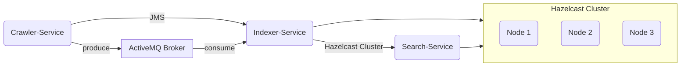

# 📘 Stage 3 – Distributed Search Cluster
### Distributed Systems – ULPGC
### Microservices + Hazelcast + ActiveMQ + Spring Boot

---

## 🧩 Project Description

The goal of *Stage 3* is to build a **distributed search system** composed of:

- 🕷️ Distributed Crawler
- 🧠 Distributed Indexer
- ☁️ Hazelcast Cluster to store the inverted index
- 🔗 Communication using ActiveMQ (JMS)
- 🔍 REST API for search queries

The system is designed to run in a **distributed**, **scalable**, and **fault-tolerant** environment, supporting **6 or more machines**.

---

## 🏗️ General Architecture

## 📦 Structure

## 🔧 Technologies Used
| Technology   | Usage                   |
| ------------ | ----------------------- |
| Spring Boot  | Microservices           |
| ActiveMQ     | JMS Messaging           |
| Hazelcast    | Distributed Cluster     |
| Maven        | Dependency Management   |
| Java 17      | Programming Language    |

## 📦 Modules

### CRAWLER-SERVICE
Functions:
+ Downloads documents from URLs

+ Saves files in /data

+ Sends DocumentEvent to ActiveMQ
  GET /crawl?url=...

### INDEXER-SERVICE
Functions:
+ Listens to JMS messages in the queue

+ Reads files from disk

+ Tokenizes text

+ Inserts tokens into Hazelcast

### SEARCH-SERVICE
Functions:
+ Queries Hazelcast from a REST endpoint.

## 🌐 Deployment on Multiple Computers

| IP           | Service         |
| ------------ | --------------- |
| 192.168.1.10 | search-service  |
| 192.168.1.11 | indexer-service |
| 192.168.1.12 | crawler-service |
| 192.168.1.13 | hazelcast node  |
| 192.168.1.14 | hazelcast node  |
| 192.168.1.15 | hazelcast node  |
